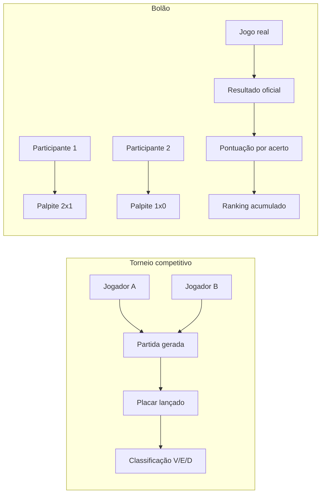
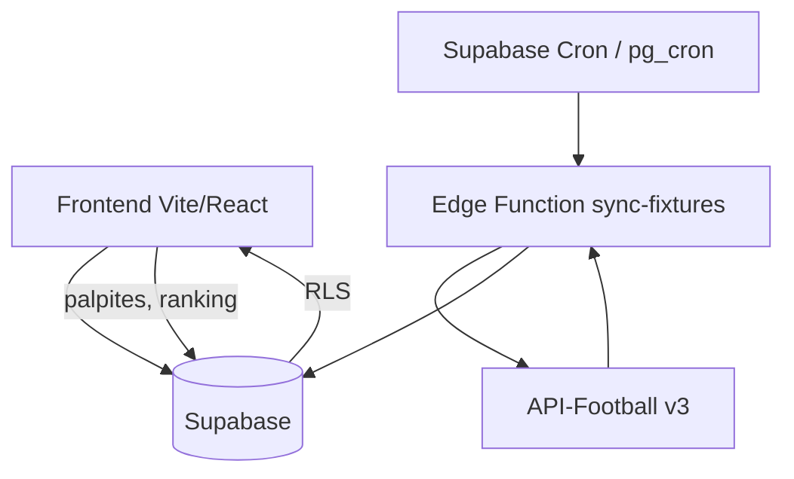

# Plano: Bolão Copa do Mundo 2026

Documento de planejamento para adicionar o modo **Bolão** ao BeScore, com foco inicial na **Copa do Mundo FIFA 2026**.

---

## 1. Contexto e objetivo

### Situação atual

- Na criação de torneio existe um select **"Jogo"** (`game_type`) com opções como eFootball, LoL, CS2 e Valorant.
- Esse campo é **apenas cosmético** — não altera regras, telas nem fluxo.
- O que funciona de fato hoje é o **torneio competitivo de futebol virtual**: participantes se enfrentam, admin gera confrontos e lança placares.

### Objetivo

1. Substituir o conceito de "lista de jogos" por **tipo de torneio**.
2. Manter e evoluir o modo **competitivo** (eFootball/FPS no futuro).
3. Adicionar o modo **bolão**: participantes palpitam resultados de jogos reais da Copa 2026.
4. Usar **API-Football** como fonte de dados, com cache no Supabase.

---

## 2. Diferença entre os modos

| Aspecto | Torneio competitivo (atual) | Bolão (novo) |
|---------|----------------------------|--------------|
| Participantes | Jogadores com times | Palpiteiros (sem time) |
| Partidas | Geradas entre participantes | Jogos reais (Copa 2026) |
| Placar | Lançado pelo admin/jogadores | Resultado oficial (API) |
| Classificação | V/E/D, gols, pontos esportivos | Pontos por acerto de palpite |
| Formato | Liga, mata-mata, campeonato | Rodadas da Copa (grupos + mata-mata) |
| Lobby | Escolha/sorteio de times | Só inscrição |



---

## 3. Fonte de dados: API-Football

### Por que esta API

- Guia oficial para Copa 2026: [FIFA World Cup 2026 – API-Football](https://www.api-football.com/news/post/fifa-world-cup-2026-guide-to-using-data-with-api-sports)
- Identificadores fixos: `league=1`, `season=2026`
- ~104 jogos, 48 seleções, fases de grupos e mata-mata
- Bandeiras, datas UTC, estádios, status ao vivo
- Plano **free**: 100 requisições/dia, 10/min — suficiente para MVP com cache

### Endpoints principais

| Uso | Endpoint |
|-----|----------|
| Importar calendário completo | `GET /fixtures?league=1&season=2026` |
| Detalhe de um jogo | `GET /fixtures?id={fixture_id}` |
| Jogos ao vivo | `GET /fixtures?live=all` (filtrar league=1) |
| Seleções | `GET /teams?league=1&season=2026` |

### Alternativa (fallback)

**football-data.org** — competição `WC`, free forever, 10 req/min. Placares com atraso no free; útil como backup, não como primária.

### Regra de segurança

A chave da API **nunca** vai no frontend. Toda comunicação passa por **Supabase Edge Function** (proxy + sync).

---

## 4. Modelo de dados

### 4.1 Alterações em `tournaments`

Adicionar `mode` em `settings` (JSONB existente):

```typescript
export type TournamentMode = 'competitive' | 'bolao'

export interface BolaoSettings {
  championship: 'world_cup_2026'
  externalLeagueId: 1          // API-Football league ID
  externalSeason: 2026
  scoringRules: 'classic' | 'custom'
  pointsExact: number          // default: 5
  pointsDiff: number           // default: 3  (vencedor + diferença de gols)
  pointsWinner: number         // default: 1  (só acertou quem ganhou)
  lockMinutesBeforeKickoff: number  // default: 5
}

export interface TournamentSettings {
  mode: TournamentMode
  competitiveGame?: 'eFootball' | 'CS2' | 'Valorant' | 'LoL'
  bolaoSettings?: BolaoSettings
  // ... campos existentes
}
```

Manter `game_type` por compatibilidade (ex.: `'Bolão'` ou `'eFootball'`), mas a lógica passa a usar `settings.mode`.

### 4.2 Nova tabela: `bolao_fixtures`

Espelho local dos jogos reais (cache da API).

```sql
CREATE TABLE bolao_fixtures (
  id              uuid PRIMARY KEY DEFAULT gen_random_uuid(),
  tournament_id   uuid NOT NULL REFERENCES tournaments(id) ON DELETE CASCADE,
  external_id     integer NOT NULL,           -- fixture_id da API-Football
  round           text,                       -- ex: "Group A - 1", "Round of 16"
  home_team       text NOT NULL,
  away_team       text NOT NULL,
  home_team_logo  text,
  away_team_logo  text,
  kickoff_at      timestamptz NOT NULL,
  status          text NOT NULL DEFAULT 'scheduled',
                  -- scheduled | live | finished | postponed | cancelled
  home_score      integer,
  away_score      integer,
  synced_at       timestamptz DEFAULT now(),
  UNIQUE (tournament_id, external_id)
);

CREATE INDEX idx_bolao_fixtures_tournament ON bolao_fixtures(tournament_id);
CREATE INDEX idx_bolao_fixtures_kickoff ON bolao_fixtures(kickoff_at);
CREATE INDEX idx_bolao_fixtures_status ON bolao_fixtures(status);
```

### 4.3 Nova tabela: `bolao_predictions`

Palpites dos participantes.

```sql
CREATE TABLE bolao_predictions (
  id              uuid PRIMARY KEY DEFAULT gen_random_uuid(),
  fixture_id      uuid NOT NULL REFERENCES bolao_fixtures(id) ON DELETE CASCADE,
  participant_id  uuid NOT NULL REFERENCES participants(id) ON DELETE CASCADE,
  home_score      integer NOT NULL CHECK (home_score >= 0),
  away_score      integer NOT NULL CHECK (away_score >= 0),
  points_earned   integer,                    -- null até o jogo terminar
  locked_at       timestamptz,                -- quando o palpite foi travado
  created_at      timestamptz DEFAULT now(),
  updated_at      timestamptz DEFAULT now(),
  UNIQUE (fixture_id, participant_id)
);

CREATE INDEX idx_bolao_predictions_participant ON bolao_predictions(participant_id);
CREATE INDEX idx_bolao_predictions_fixture ON bolao_predictions(fixture_id);
```

### 4.4 Regras de pontuação (classic)

| Acerto | Pontos |
|--------|--------|
| Placar exato | 5 |
| Vencedor + diferença de gols correta | 3 |
| Só o vencedor (ou empate) | 1 |
| Errou | 0 |

Implementar em função SQL ou Edge Function `calculatePredictionPoints(homePred, awayPred, homeResult, awayResult)`.

---

## 5. Arquitetura



### Componentes novos

| Camada | Arquivo / recurso | Responsabilidade |
|--------|-------------------|------------------|
| Edge Function | `supabase/functions/sync-bolao-fixtures` | Importar/atualizar jogos da Copa |
| Edge Function | `supabase/functions/score-bolao-predictions` | Calcular pontos após resultado |
| Migration | `supabase/migrations/..._bolao_tables.sql` | Schema + RLS |
| Service | `src/lib/bolaoService.ts` | CRUD palpites, ranking, fixtures |
| Types | `src/types/bolao.ts` | Tipos TypeScript |
| Config | `src/config/tournamentModes.ts` | Modos, labels, ícones |
| Tela | `src/screen/CreateBolao/` | Criação simplificada |
| Tela | `src/screen/BolaoView/` | Rodadas, palpites, ranking |
| Env | `API_FOOTBALL_KEY` (secret Supabase) | Chave da API |

### Estratégia de cache (free tier)

| Ação | Frequência | Req/dia |
|------|----------|---------|
| Import inicial (104 jogos) | 1x na criação | 1 |
| Sync de resultados (dias sem jogo) | 2x/dia | 2 |
| Sync em dias de jogo | a cada 30 min (8h) | ~16 |
| Sync manual (admin) | sob demanda | variável |
| **Total estimado** | | **~20/dia** |

---

## 6. RLS (Row Level Security)

### `bolao_fixtures`

- **SELECT**: participantes do torneio + torneios públicos.
- **INSERT/UPDATE**: apenas via Edge Function (service role) ou criador do torneio.

### `bolao_predictions`

- **SELECT**: próprio participante vê todos os palpites **após** `kickoff_at + lockMinutes` (ou só os próprios antes).
- **INSERT/UPDATE**: próprio participante, somente se `now() < kickoff_at - lockMinutes`.
- **DELETE**: não permitido (ou só admin antes do lock).

---

## 7. Fluxos de usuário

### 7.1 Criação do bolão (admin)

1. Escolhe **Tipo: Bolão**.
2. Seleciona **Copa do Mundo 2026** (única opção no MVP).
3. Define regras de pontuação (default classic).
4. Define privacidade e limite de participantes.
5. Ao salvar → Edge Function importa fixtures da API.
6. Redireciona para lobby (sem config de times/confrontos).

### 7.2 Lobby

- Reutilizar `TournamentLobby` com adaptações:
  - Ocultar seleção de times.
  - Ocultar "Gerar partidas".
  - Botão admin: **Sincronizar jogos** (força sync).
  - Status: "Aguardando palpites" / "Copa em andamento".

### 7.3 Tela principal do bolão

Abas:

1. **Palpites** — jogos da rodada/fase, formulário de placar, countdown até lock.
2. **Ranking** — tabela acumulada por participante.
3. **Jogos** — calendário completo com resultados oficiais.

### 7.4 Palpite

- Participante informa placar (ex: 2x1).
- Pode editar até X minutos antes do apito inicial.
- Após lock: palpite visível para todos (opcional: esconder até lock global da rodada).

### 7.5 Pontuação automática

- Cron detecta fixture com `status = finished` e placar preenchido.
- Edge Function calcula pontos de todos os palpites daquele jogo.
- Ranking atualizado em tempo real (Supabase Realtime opcional).

---

## 8. Mudanças na UI de criação

### Antes

```
Jogo: [ eFootball | LoL | CS2 | Valorant ]
```

### Depois

```
Tipo de torneio: [ Competitivo | Bolão ]

Se Competitivo:
  Jogo: [ eFootball ]  (demais ocultos até ter suporte)
  Formato: liga / mata-mata / ...
  Times, ida/volta, etc. (como hoje)

Se Bolão:
  Campeonato: [ Copa do Mundo 2026 ]
  Pontuação: classic (5/3/1) ou custom
  Lock de palpite: [ 5 ] minutos antes
  (sem times, sem formato de confronto)
```

---

## 9. Roteamento

| `settings.mode` | Rota após lobby |
|-----------------|-----------------|
| `competitive` | `/tournament/:id/match` (atual) |
| `bolao` | `/tournament/:id/bolao` (nova) |

Implementar gate em `TournamentContextGate` ou equivalente para redirecionar conforme o modo.

---

## 10. Fases de implementação

### Fase 1 — Fundação (1–2 dias)

- [ ] Migration: tabelas `bolao_fixtures` e `bolao_predictions` + RLS
- [ ] Types: `TournamentMode`, `BolaoSettings`, tipos de fixture/prediction
- [ ] `settings.mode` na criação (refatorar select "Jogo" → "Tipo")
- [ ] Edge Function: `sync-bolao-fixtures` (import Copa 2026)
- [ ] Secret: `API_FOOTBALL_KEY` no Supabase
- [ ] Teste manual: criar torneio bolão → ver fixtures no banco

### Fase 2 — MVP bolão (3–5 dias)

- [ ] `bolaoService.ts`: listar fixtures, salvar/editar palpite, ranking
- [ ] Tela `BolaoView`: abas Palpites + Ranking
- [ ] Lógica de lock (não editar após kickoff - N min)
- [ ] Edge Function: `score-bolao-predictions`
- [ ] Cron: sync 4x/dia + intensificado em dias de jogo
- [ ] Adaptar lobby para modo bolão
- [ ] Adaptar `TournamentCard` (badge "Bolão ⚽")

### Fase 3 — Polish (2–3 dias)

- [ ] Countdown até lock na UI
- [ ] Palpites ocultos até abertura da rodada (opcional)
- [ ] Sync manual no painel admin
- [ ] Bandeiras das seleções (cache de logos da API)
- [ ] Notificação: "Rodada X aberta para palpites"
- [ ] PreviewCard adaptado para bolão

### Fase 4 — Evoluções (futuro)

- [ ] Outros campeonatos (Brasileirão, Champions)
- [ ] Regras de pontuação customizáveis na UI
- [ ] Palpite em lote (preencher rodada inteira)
- [ ] Supabase Realtime no ranking
- [ ] Modo competitivo para CS2/Valorant (quando houver regras específicas)
- [ ] Plano pago API-Football se ultrapassar 100 req/dia

---

## 11. Variáveis de ambiente

### Supabase (secrets — Edge Functions)

```
API_FOOTBALL_KEY=xxxxxxxxxxxxxxxxxxxxxxxx
```

### Frontend (`.env.example` — documentar)

```
# Nenhuma chave de API-Football no frontend.
# Sync roda via Edge Functions.
```

---

## 12. Riscos e mitigações

| Risco | Mitigação |
|-------|-----------|
| Limite de 100 req/dia estourado | Cache agressivo; sync sob demanda; upgrade Pro ($19/mo) |
| API fora do ar | Dados em `bolao_fixtures`; admin lança resultado manual |
| Palpite após kickoff (fuso horário) | Usar UTC; lock com margem de 5 min |
| `game_type` legado | Manter campo; migrar lógica para `settings.mode` |
| Partidas adiadas | Status `postponed`; reabrir palpites se necessário (admin) |

---

## 13. Critérios de aceite (MVP)

1. Admin cria bolão "Copa 2026" e vê ~104 jogos importados.
2. Participante entra pelo código, palpita placar de jogos futuros.
3. Palpite não pode ser editado após lock.
4. Quando jogo termina (sync), pontos são calculados automaticamente.
5. Ranking mostra posição, pontos totais e palpites por jogo.
6. Torneio competitivo existente continua funcionando sem regressão.

---

## 14. Referências

- [API-Football – Copa 2026](https://www.api-football.com/news/post/fifa-world-cup-2026-guide-to-using-data-with-api-sports)
- [API-Football – Documentação v3](https://www.api-football.com/documentation-v3)
- [API-Football – Pricing](https://www.api-football.com/pricing)
- [football-data.org – API WC](https://www.football-data.org/documentation/api) (fallback)
- Ciclo de vida atual: `TOURNAMENT_LIFECYCLE.md`
- Regras de negócio: `REGRAS_BESCORE.md`

---

*Documento gerado em maio/2026. Revisar após validação da API com `league=1&season=2026`.*
